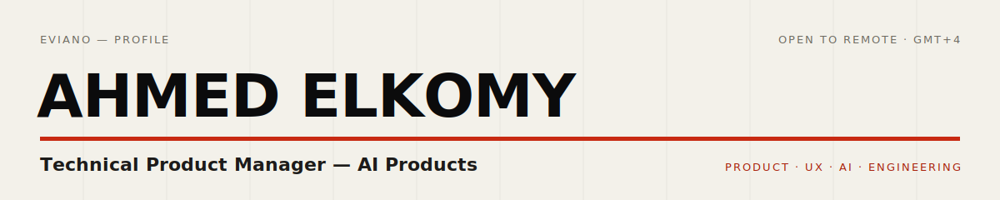
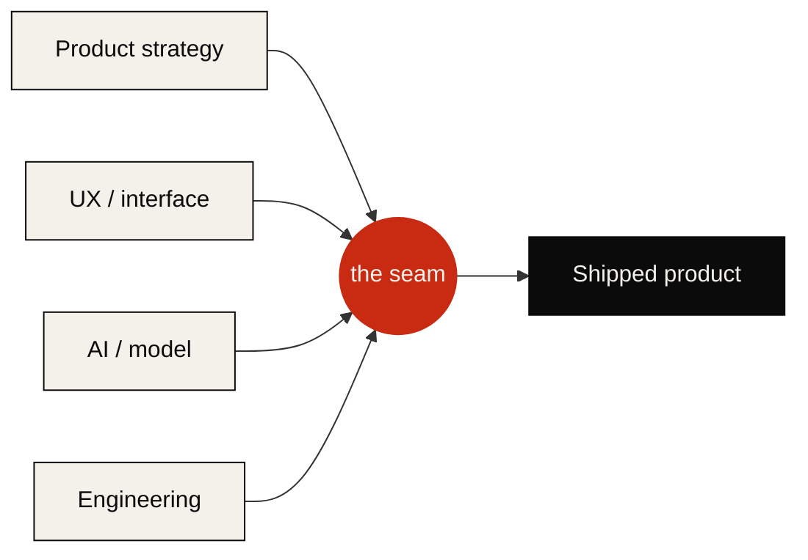

<a href="https://eviano.link">
  
</a>

<div align="center">

<a href="https://eviano.link">
  
</a>

**Technical Product Manager** building across `product` · `UX` · `AI` · `engineering`.
Nine years shipping revenue-driving products. I work the seams between the layers, so the product that gets decided is the product that ships.

[](https://eviano.link)
[](https://eviano.link)
[](https://www.linkedin.com/in/eviano)
[](mailto:hello@eviano.link)
[](https://soundcloud.com/evianoo)

</div>

---

### <samp>01 · WHOAMI</samp>

```ts
const eviano = {
  name: "Ahmed Elkomy",
  role: "Technical Product Manager — AI Products",
  thesis: "Products don't fail at a layer. They fail in the seam between them.",
  layers: ["product", "ux", "ai", "engineering"] as const,
  buildsAcross: (idea: Idea) => ship(idea),        // strategy to shipped code, solo
  provenBy: "a live multi-tenant SaaS with paying customers, built alone",
  buildingNow: [
    "Menyo Pro — restaurant operations, end to end",
    "Arabic-first WhatsApp AI agents for MENA service businesses",
  ],
  dailyDrivers: ["Claude Code", "agent pipelines", "n8n", "Gemini"],
  based: "UAE · remote (GMT+4)",
  openTo: "remote Product / Technical PM roles",
  obsessedWith: ["the handoff", "real-time systems", "AI you can trust", "type safety"],
  offHours: "electronic music (trance to techno) in a DAW",
};
```

---

### <samp>02 · THE SEAM</samp>



Most teams lose the product in the gaps between those boxes. I live in the red node.

---

### <samp>03 · BUILDING NOW</samp>

**[Menyo Pro](https://riva-21.menyo.pro)** — restaurant operations SaaS, designed, built, shipped, and **operated as a solo founder, PM, and engineer**. Live in production with paying customers.
Point a camera at a paper menu, get a live digital ordering system in minutes; POS, kitchen display, reservations, loyalty, and analytics on one real-time, multi-tenant platform.

`Next.js 16` · `React 19` · `tRPC` · `Prisma` · `PostgreSQL` · `Redis` · `Stripe Connect` · `Gemini`

**Menyo Concierge** *(in build)* — Arabic-first WhatsApp AI agent for MENA service businesses. Takes bookings and orders in Gulf and Egyptian dialect, hands off to a human when it should, and runs on the official WhatsApp Cloud API. Restaurants first — they already run on Menyo.

---

### <samp>04 · OPEN SOURCE</samp>

**[tribunal](https://github.com/eviano/tribunal)** — a deterministic, no-LLM-in-the-loop CI gate for the age of agent-written code. Catches agent-PR defects that slip past human review: assertion-free tests, hallucinated symbols, and PR claims that contradict the diff.
*Thesis: if agents write the code, the gate that judges it must not be an agent.*

---

### <samp>05 · FIELD RESULTS</samp>

| # | Result | Where |
|---|--------|-------|
| `+$47K` | additional monthly revenue from a collaborative-filtering recommendation engine (2M+ interactions) | ARTime |
| `50+` | restaurants adopted a computer-vision QR menu platform; order processing time −25% | ARTime |
| `+35%` | monthly active users (12K → 16.2K) in 18 months | ARTime |
| `+20%` | checkout conversion (2.3% → 2.8%) from a redesigned 3-step payment journey | ARTime |
| `−22%` | support ticket volume via an NLP chatbot over GraphQL | ARTime |
| `95%` | on-time sprint delivery across a cross-functional team of 8 | ARTime |
| `< 3 min` | from a photo of a paper menu to a live ordering site, LLM-powered | Menyo Pro |

---

### <samp>06 · TOOLKIT</samp>

**Product & design**


**AI & agents**


**Frontend**


**Backend & infra**


---

### <samp>07 · SIGNAL</samp>

<div align="center">


<br/>


</div>

---

<div align="center">

<code>strategy</code> · <code>interface</code> · <code>model</code> · <code>shipped code</code> — held together by one person, on purpose.

**[eviano.link](https://eviano.link)** · <samp>hello@eviano.link</samp>

</div>
